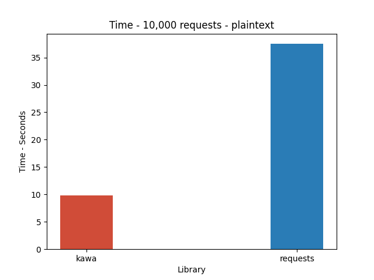
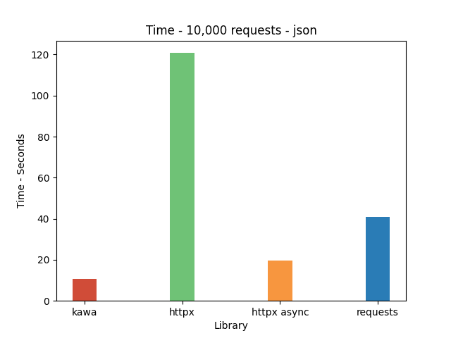

# What is Kawa?

Kawa is a lightweight HTTP client for python 🐍, built in Rust! 🦀

# Goals

Kawa aims to be a small HTTP client with a fairly sized feature set, with good performance and speed. Kawa does not aim to be a replacement for `requests`. Kawa simply will implement the HTTP protocol for you and allow you to send HTTP messages, however will not perform any convenience functions, such as serializing `json` data for you. This will need to be done by you.


## Features

- [x] HTTP support
- [ ] HTTPS support
- [ ] WebSocket support


# Current Benchmarks

As with all benchmarks, please take this with a grain of salt.
All benchmarks are tested on a local server made with [`litestar`](https://litestar.dev/), which is run with [`uvicorn`](https://www.uvicorn.org/)

The benchmarks are run on the following machine:
```
  Model Name:	MacBook Pro
  Model Identifier:	MacBookPro11,3
  Processor Name:	Quad-Core Intel Core i7
  Processor Speed:	2.8 GHz
  Number of Processors:	1
  Total Number of Cores:	4
  L2 Cache (per Core):	256 KB
  L3 Cache:	6 MB
  Hyper-Threading Technology:	Enabled
  Memory:	16 GB
```

### 10k Plaintext GET requests



### 10k JSON POST requests

Using the `json` library to serialize the data every request.

